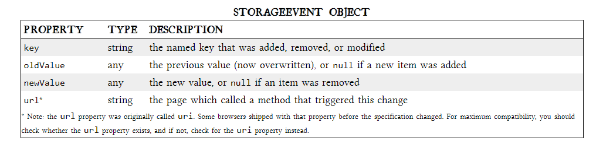

# **Local-Storage**

#### &nbsp; local storage is one of the areas where native client applications have held an advantage over web applications. &nbsp;These values may be stored in the registry, INI files, XML files, or some other place.   &nbsp;If your native client application needs local storage beyond key/value pairs, you can embed your own database, invent your own file format, or any number of other solutions.

<!-- But they have three potentially dealbreaking downsides:
slowing down your web application
sending data unencrypted over the internet
limited to about 4 KB of data,not enough -->

- What we really want is:
  1.  a lot of storage space
  2.  on the client
  3.  that persists beyond a page refresh
  4.  and isn’t transmitted to the server

Before HTML5, all attempts to achieve this were ultimately unsatisfactory in different ways.

## LOCAL STORAGE BEFORE HTML5

#### In the beginning with store up to 64 KB of data per domain, In 2002, Adobe allows Flash objects to store up to 100 KB of data per domain. Then Google launched Gears, an open-source browser plugin aimed at providing additional capabilities in browsers.

 

 

## INTRODUCING HTML5 STORAGE

- “HTML5 Storage” is called Web Storage ,and also called “Local Storage” or “DOM Storage ”.

### What is HTML5 Storage?  

- Simply put, it’s a way for web pages to store named key/value pairs locally, within the client web browser.

- It has the **same thing as cookies** " data persists even after you navigate away from the web site, close your browser tab, exit your browser "
- It have **different things about cookies** are:

  - data is never transmitted to the remote web server
  - Unlike all previous attempts, it is implemented in web browsers, so it is available even when third-party browser plugins are not.

  #### browser supports HTML5 Storage :

  - IE , 8.0+
  - FIREFOX , 3.5+
  - SAFARI , 4.0+
  - CHROME , 4.0+
  - OPERA , 10.5+
  - IPHONE , 2.0+
  - ANDROID , 2.0+

### check for HTML5 Storage

## USING HTML5 STORAGE

- HTML5 Storage is based on named key/value pairs.
- The named key is a string. The data can be any type supported by JavaScript
- The data is actually stored as a string.

#### If you are storing and retrieving anything other than strings, you will need to use functions like parseInt() or parseFloat() to coerce your retrieved data into the expected JavaScript datatype.

> interface Storage {  getter any getItem(in DOMString key);  setter creator void setItem(in DOMString key, in any data);  };

- _Calling setItem()_ with a named key that already exists will overwrite the previous value.
- _Calling getItem()_ with a non-existent key will return null rather than throw an exception.
  
  - There are also methods for removing the value for a given named key, and clearing the entire storage area (that is, deleting all the keys and values at once).
  - Calling removeItem() with a non-existent key will do nothing.
- If you call key() with an index that is not between 0–(length-1), the function will return null.

### STORAGEEVENT OBJECT

