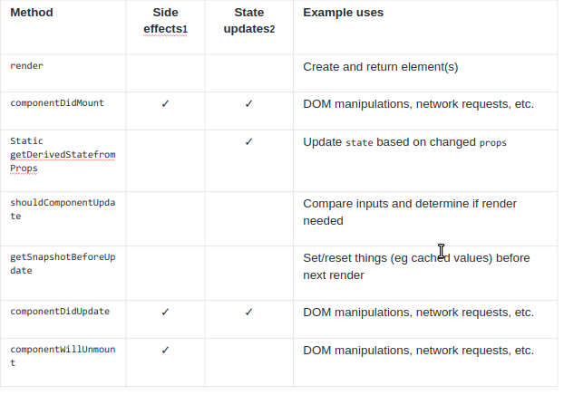

# React (State and Props)
  
  

### What are component lifecycle events?
* React lets you define components as classes or functions. The methods that you are able to use on these are called lifecycle events. These methods can be called during the lifecycle of a component, and they allow you to update the UI and application states.  [from](https://medium.com/@joshuablankenshipnola/react-component-lifecycle-events-cb77e670a093)

  
  

## Props vs State

### Props
   *  passed into the component(not inside).
   * render dynamic data.
   * dealing with title and subtitle.

### State 
   * inside the component.
   * not deling with dynamic data.
   * not deling with title and subtitle.
   * What does setState do? [from](https://reactjs.org/docs/faq-state.html)
        * setState() schedules an update to a component’s state object. When state changes, the component responds by re-rendering.

   >   
   >   

   #### React Bootstrap
    * React-Bootstrap replaces the code to react components,without unneeded dependencies and that givs us more countrol with the component.