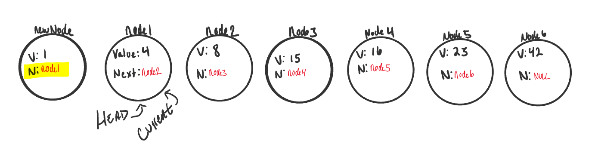
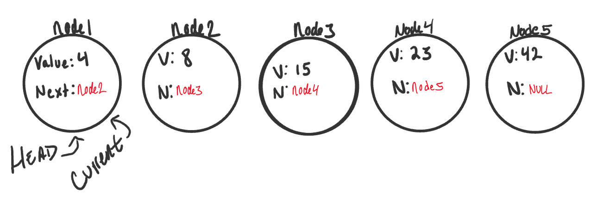
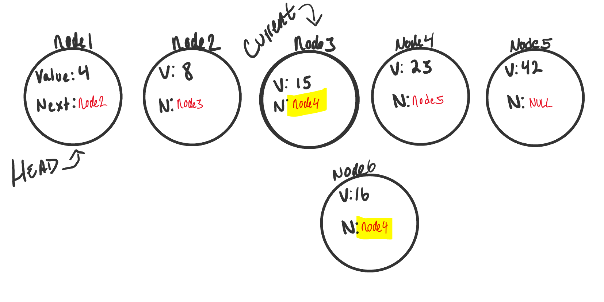
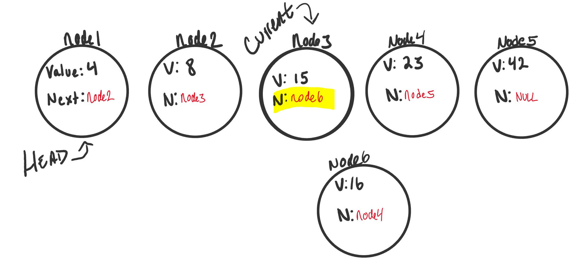

# Linked Lists [📁](https://codefellows.github.io/common_curriculum/data_structures_and_algorithms/Code_401/class-05/resources/singly_linked_list.html)

 

## Q:What is a Linked List?

- 'A Linked List is a sequence of _Nodes_ that are connected to each other. The most defining feature of a Linked List is that each _Node_ references the next _Node_ in the link.'

> you can Linked List with two ways " _Singly_ and _Doubly_".

## Singly

- This is what a Singly Linked List looks like

- you are not able to use a _foreach_ or for _loop_,We depend on the _Next_ value in each node
- The _Next_ property is important because (it will lead us **where** the next node is and allow us to **extract** the data appropriately).
- The best way to approach a traversal is through the use of a _while_() loop >>> to check that the **Next node** in the list is **not null**. If we reach at the end to( node that is **null**), a **NullReferenceException** gets thrown and our program will >>> _crash/end_.

* When finishing the linked list, the Current variable will tell us where exactly in the linked list we are and will allow us to move forward until we hit the end.

### Traversal Big O

- The Big O of _time_ for Includes would be **O(n)**. n >>>> **last node in the linked list**

* The Big O of _space_ for Includes would be O(1). >> because there is **no additional space** being used than what is already given to us in input.

### Adding a Node >> like: Adding O(1)

- An example can be with adding a node to a linked list. If we want to add a node with an O(1) efficiency, we have to replace the current Head of the linked list with the new node, without losing the reference to the next node in the list.

1. 
2. 
3. 

### Adding a Node >> like: Adding O(n)

- Adding a node to the middle of a linked list is a bit different than adding to the beginning. This is because we are working with more nodes and must re-allocate to make room for the new node.

1. 
2. 
3. 
4. 

### Print Out Nodes

- we are creating a _while_ loop to check and make sure we are not at the end of a linked list. Right before the _while_ loop restarts, we move _Current_ to equal the next node in the list.

- Once we hit the end, we write out the _null_ pointed to by the last node (or _Head_, if it’s empty).

 
 

- When making your Node class, consider requiring a value to be passed in to require that each node has a value.

   

# What’s a Linked List, Anyway?

- linked lists is that they are linear data structures

### let's look on: Linear data structures

- in order to get to the end of the list, we have to go through all of the items in the list in order(sequentially)

* the opposite of non-linear structures

### Memory management

- When an array is created, it needs a certain amount of memory.
- But, we’d need all of that memory in one contiguous block.
- our computer would need to locate 7 bytes of memory that was free, one byte next to the another
- when a linked list is born, it doesn’t need 7 bytes of memory all in one place.One byte could live somewhere, while the next byte could be stored in another place in memory altogether!

 

- The fundamental **difference** between arrays and linked lists is that arrays are static data structures, while linked lists are dynamic data structures.

- but no matter the size, the parts that make it up are actually fairly simple. A linked list is made up of a series of nodes, which are the elements of the list.
- The starting point of the list is a reference to the first node, which is referred to as the head.
- The end of the list isn’t a node, but rather a node that points to null, or an empty value.

> A node only knows about what data it contains, and who its neighbor is.

#### the bath >>> There is a single track that we can traverse the list in; we start at the head node, and traverse from the root until the last node, which will end at an empty null value.

   

- A single node is also pretty simple. It has just two parts: data, or the information that the node contains, and a reference to the next node

### first thing what even is Big O?

- Big O is really all over and omnipresent within computer science.

- There are two major points to consider when thinking about how an algorithm performs: how much time it requires at runtime given how much time and memory it needs.

- One way to think about Big O notation is a way to express the amount of time that a function, action, or algorithm takes to run based on how many elements we pass to that function.

#### An O(1) function takes constant time, which is to say that it doesn’t matter how many elements we have, or how huge our input is: it’ll always take the same amount of time and memory to run our algorithm.

#### An O(n) function is linear, which means that as our input grows (from ten numbers, to ten thousand, to ten million), the space and time that we need to run that algorithm grows linearly.

 

### To list or not to list?

- a linked list is usually efficient when it comes to adding and removing most elements, but can be very slow to search and find a single element.

 

[📁](https://medium.com/basecs/whats-a-linked-list-anyway-part-1-d8b7e6508b9d)

 

[📁](https://medium.com/basecs/whats-a-linked-list-anyway-part-2-131d96f71996)
